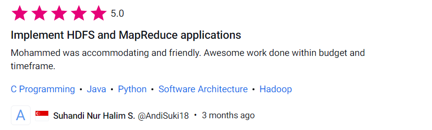
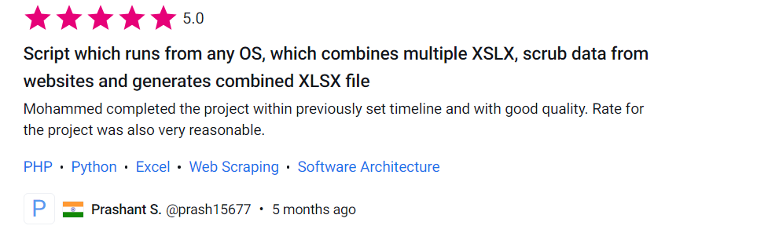
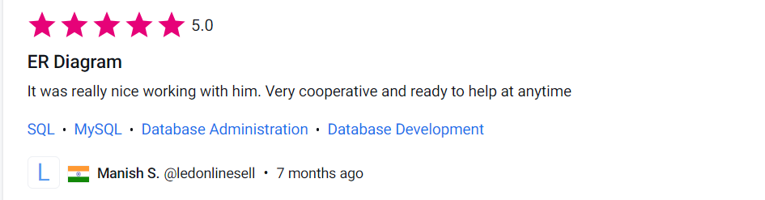

## Freelance-Reviews

## `Project 1: Big data analysis using a Hadoop clustrer and Mapreduce`

## `Project 2: Price comparator bot`
### skills : Web Scraping, Automation

## `Project 3: Data Analytics`

## `Project 4: Big Data Project`

## `Project 5: Database Design & Implementation`
### Database design

### Implementation

## `Project 6: Web Scraping` 

## `Project 7: Entity relationship diagram`

## `Project 8: Bash Scripting`

